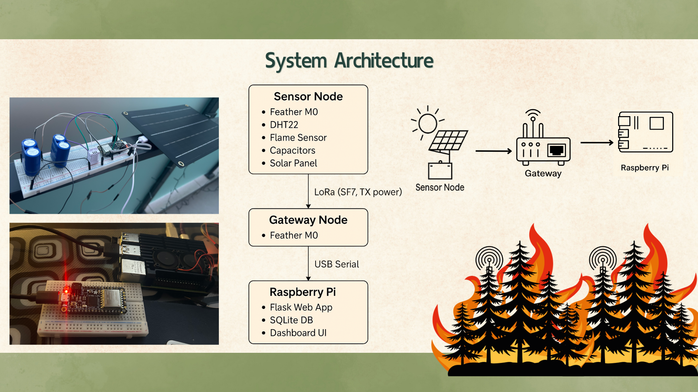

# 🌲 Energy-Aware IoT Forest Monitoring System

This repository contains the implementation and experimental evaluation of an **energy-aware IoT monitoring system** designed for long-term environmental monitoring in remote forest environments.

The system uses **LoRa-enabled sensor nodes powered by supercapacitors** to collect environmental data and transmit it to a gateway connected to a **Raspberry Pi backend**. The project investigates how IoT nodes can operate autonomously using **adaptive power management techniques**.

This project was developed as part of my **Honours Research Thesis at Deakin University**.

---

# 📌 Project Objectives

The main goals of this project are:

- Investigate **energy-efficient IoT node design**
- Evaluate **supercapacitor-based energy storage**
- Implement **adaptive sleep scheduling**
- Monitor **environmental conditions and node performance**
- Analyse how **LoRa transmission parameters affect energy usage**

---

# ⚙️ System Architecture

The monitoring system consists of three main components.

The system consists of a LoRa-based sensor node that transmits environmental data to a gateway, which forwards the information to a Raspberry Pi backend for storage and visualisation.

### Data Flow

1. Sensor node collects environmental data
2. Data is transmitted using LoRa
3. Gateway receives packets and forwards them via Serial
4. Raspberry Pi logs data into a database
5. Dashboard visualises system behaviour and environmental conditions

---

# 🛰️ Hardware Components

### Sensor Node (Transmitter)

- Arduino Feather M0 LoRa
- DHT22 Temperature & Humidity Sensor
- DFRobot Flame Sensor
- Voltage Divider Circuit
- Supercapacitors (5.5V 15F)
- LoRa antenna

The node periodically measures:

- Temperature
- Humidity
- Flame detection
- Capacitor voltage
- Node uptime

Data is transmitted via **LoRa packets**.

---

### Gateway Node (Receiver)

- Arduino Feather M0 LoRa

Responsibilities:

- Receive LoRa packets
- Extract signal metrics (RSSI, SNR)
- Forward data to Raspberry Pi through Serial communication
- Confirm packet reception using LED indicators

---

### Backend System

The backend runs on a **Raspberry Pi** and performs:

- Serial data reception
- Data parsing
- CSV and database logging
- Data visualisation

Technologies used:

- Python
- Flask
- SQLite
- Serial communication

---

# 📊 Experiments Conducted

Several experiments were performed to evaluate energy performance.

### Baseline Tests

- 1 Supercapacitor configuration
- 2 Supercapacitors in parallel
- 4 Supercapacitors configuration

These tests evaluate:

- Node uptime
- Voltage decay behaviour
- Transmission stability

---

### Sleep Interval Experiments

Adaptive sleep intervals were tested:

- 15 seconds
- 30 seconds
- 60 seconds

Goal:

- Analyse trade-off between **data transmission frequency and energy consumption**

---

### Solar-Assisted Testing

The system was also tested with **solar charging** to evaluate the feasibility of **long-term autonomous operation**.

---

# 📂 Repository Structure

---

# 📈 Data Collected

Each transmitted packet includes:

- Temperature
- Humidity
- Flame sensor status
- Capacitor voltage
- Node uptime
- RSSI
- SNR
- Timestamp

The data is logged to **CSV files** and can be visualised using the Flask dashboard.

---

# 🚀 Future Improvements

Possible extensions for this project include:

- Dynamic **LoRa spreading factor optimisation**
- **Machine learning-based energy forecasting**
- Event-driven data transmission
- Multi-node mesh network deployment
- Weather-aware energy management
- Remote node reconfiguration via LoRa downlink

---

# 🎓 Research Thesis

This project was developed as part of the following research thesis:

**Energy-Aware IoT-Based Forest Fire Monitoring Systems**  
Bachelor of Software Engineering (Honours)  
Deakin University

The thesis investigates how IoT systems can operate in remote environments through **adaptive energy management techniques**.

---

# 🧑‍💻 Author

**Sohil Nagpal**  
Software Engineering (Honours) Graduate  
Deakin University

GitHub  
https://github.com/sohilnagpal04

LinkedIn  
https://linkedin.com/in/sohilnagpal

---

# 📜 License

This project is released under the **MIT License**.

---

# ⭐ Acknowledgements

- Deakin University
- Robotics & IoT Lab
- Supervisors and research mentors

---

If you found this project interesting, feel free to ⭐ star the repository.
